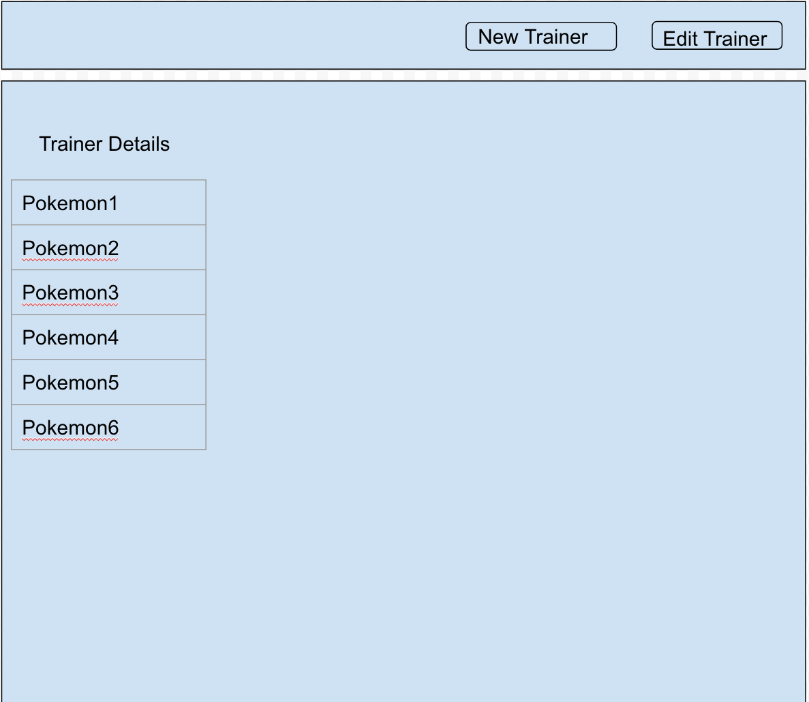

# GA-Project-2

## Description
A full CRUD app that keeps track of Trainers, and the pokemon they own.

## Project Links
[Repository](https://github.com/Suzukiiiii/GA-Project-2)

[Heroku deployment](https://joshua-suzuki-project2.herokuapp.com/)

## Wireframes and Diagrams

## User Stories
- As a user, I should be able to create a new Trainer.
- I should be able to delete a Trainer.
- I should be able to edit a Trainer's name
- All trainers should be displayed on the home page.
- Clicking on a Trainer's name should redirect to a show page with their details.
- On A Trainer's show page, clicking on 'Catch a Pokemon' should give them a random pokemon
- A Trainer may not have more than 6 Pokemon.
- Clicking on a pokemon's name should bring me to its show page.
- I should be able to train a Pokemon and increase its level.
- I should be able to delate a Pokemon.

## Design Approach

A Trainer has a name and an array of pokemon (max size of 6).
A Pokemon has a species, links to their sprites, and a reference to the owning Trainer.

They share a many to one relationship.

## Technologies Used
Node.js

Mongoose

[PokeAPI](https://pokeapi.co/)

## Future Enhancements

Add styling

Add sessions

Add ability to trade pokemon

Allow two Pokemon to fight